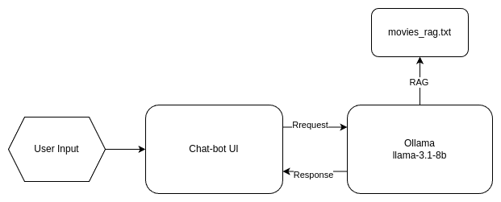

# FilmBuddy

**MTAHacks 2025 winner!**

A friendly chat-bot that will recommnend you the perfect movie to watch on your day off! This project was bulit in 6 hours for the MTAHacks2025 hackathon.

## QuickStart
*requires CUDA 12*
- Create a virtual enviornment using conda with python 3.10  
`conda create -n <name> python=3.10`  
`conda activate <name>`
- Install Ollama  
`curl -fsSL https://ollama.com/install.sh | sh`
- Pull llama-3.1-8b  
`ollama pull meta/llama3:8b`
- Install some requirements using conda  
`conda install -c conda-forge libgcc-ng`  
`conda install -c pytorch -c nvidia faiss-gpu`
- Install python dependencies  
`pip install -r requirements.txt`
- Install npm dependencies  
`npm i`
- Start the Ollama service  
`sudo systemctl start ollama`
- Run the project  
`npm run dev`  

## Architecture

The UI is a modified fork from [this project](https://github.com/ChristophHandschuh/chatbot-ui) using React for front end and Flask for back end.  
Llama-3.1-8b is ran using Ollama and LangChain, preforming rag on a modified verson of [this dataset.](https://github.com/metarank/msrd)  

## License

This project is licensed under the Apache License 2.0. Please note that some components were adapted from Vercel's open source AI Chatbot project.
